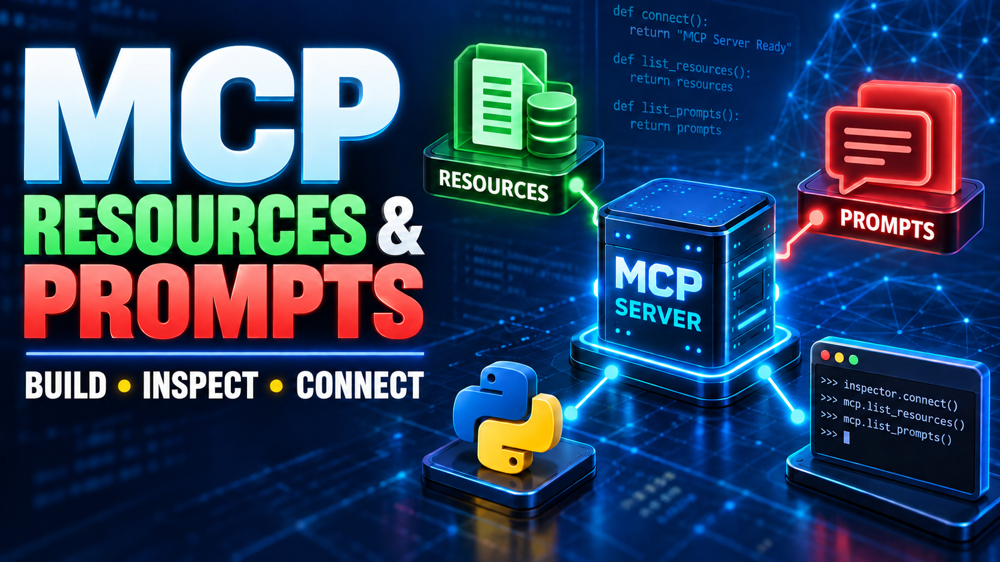
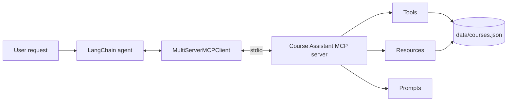

# Course Assistant MCP Server



A small teaching project that demonstrates how to build a Python [Model Context Protocol](https://modelcontextprotocol.io/) server and connect it to a LangChain agent.

The server exposes the same course catalog through three MCP primitives:

| Primitive | Purpose | Examples |
| --- | --- | --- |
| **Tools** | Let an agent perform an operation | `get_course_list`, `get_course_details` |
| **Resources** | Give a client addressable course data | `course://catalog`, `courses://cs466` |
| **Prompts** | Provide reusable task instructions | `course_summary`, `all_course_summary` |

This repository accompanies **Class 2: MCP Resources and Prompts** in the YouTube lecture series.

## What you will learn

- Build an MCP server with Python and `FastMCP`
- Define tools, resources, and reusable prompts
- Test the server with MCP Inspector
- Load MCP tools, prompts, and resources from LangChain
- Convert LangChain `Blob` resources into text
- Pass MCP prompt messages and resource context to an agent

## Architecture



## Project structure

```text
MCP-Server/
├── server.py
├── mcpAgent.ipynb
├── data/
│   └── courses.json
└── assets/
    └── mcp-resources-prompts-class2.png
```

## Requirements

- Python 3.11 or later
- [`uv`](https://docs.astral.sh/uv/)
- Node.js, required by MCP Inspector
- JupyterLab or VS Code for `mcpAgent.ipynb`
- Ollama with `gemma4:latest`, or another tool capable chat model

The notebook also initializes Groq and OpenAI models. Their API keys are only needed if you use those models.

## Setup

Clone the repository and enter the project directory:

```bash
git clone <your-repository-url>
cd MCP-Server
```

Create the environment and install the packages:

```bash
uv init
uv add mcp langchain langchain-mcp-adapters python-dotenv jupyter
```

If you use the Ollama model from the notebook:

```bash
ollama pull gemma4:latest
```

For Groq or OpenAI models, create a `.env` file:

```dotenv
GROQ_API_KEY=your_groq_key
OPENAI_API_KEY=your_openai_key
```

Do not commit `.env` files or API keys.

## Run and test the server

Start the server over standard input/output:

```bash
uv run python server.py
```

For interactive testing, launch MCP Inspector:

```bash
uv run mcp dev server.py
```

In Inspector, verify each part of the MCP interface:

1. **Tools**: call `get_course_list`, then call `get_course_details` with `CS 466`.
2. **Resources**: read `course://catalog` and `courses://cs466`.
3. **Prompts**: render `course_summary` with `course_id=CS111`.

## Server components

### Tools

```python
@mcp.tool()
def get_course_list() -> list[dict[str, Any]]:
    """Return the available course codes and titles."""


@mcp.tool()
def get_course_details(course_id: str) -> dict[str, Any]:
    """Return the complete record for one course."""
```

The helper `_normalized_course_id()` treats values such as `cs 466`, `CS466`, and `CS 466` consistently.

### Resources

```python
@mcp.resource("course://catalog")
def course_catalog() -> str:
    return json.dumps(_load_courses(), indent=2)


@mcp.resource("courses://{course_id}")
def course_resource(course_id: str) -> str:
    course = get_course_details(course_id)
    return json.dumps(course, indent=2)
```

Resources are read by URI. They return data to the MCP client and are not automatically inserted into a model conversation.

### Prompts

```python
@mcp.prompt()
def course_summary(course_id: str) -> str:
    return f"""
Using the Course Assistant resources and tools,
summarize {course_id}.

Include:
- Course description
- Major topics
- Prerequisites
- Learning objectives
- Expected student outcomes
"""
```

Prompts are reusable templates. LangChain converts the prompt returned by the MCP server into chat messages.

## Connect with LangChain

The notebook starts the local MCP server as a child process:

```python
from langchain_mcp_adapters.client import MultiServerMCPClient

client = MultiServerMCPClient(
    {
        "Course_assistant": {
            "transport": "stdio",
            "command": "uv",
            "args": ["run", "python", "server.py"],
            "cwd": "/absolute/path/to/MCP-Server",
        }
    }
)
```

Update `cwd` to the absolute path of your cloned repository.

### Load MCP tools

```python
tools = await client.get_tools(server_name="Course_assistant")
```

### Load an MCP prompt

```python
prompts = await client.get_prompt(
    "Course_assistant",
    "course_summary",
    arguments={"course_id": "CS111"},
)
```

### Load an MCP resource

```python
resources = await client.get_resources(
    server_name="Course_assistant",
    uris="courses://cs466",
)

context = "\n\n".join(resource.as_string() for resource in resources)
```

`get_resources()` returns LangChain `Blob` objects. Calling `as_string()` reads the text stored in each blob.

### Invoke the agent

```python
from langchain.messages import HumanMessage

result = await agent.ainvoke(
    {
        "messages": [
            *prompts,
            HumanMessage(
                content=f"Course reference materials:\n{context}"
            ),
        ]
    }
)

print(result["messages"][-1].content)
```

`*prompts` unpacks the list of MCP prompt messages into the agent's message list. The resource content is supplied as user context.

## Example questions

- Summarize CS 466, including prerequisites and expected outcomes.
- How many courses are available? Give each course code and title.
- What software or course materials are required for CS 466?
- What are three learning outcomes for CS 111?
- Explain the grading criteria for CS 111.

## Troubleshooting

### The client cannot start `server.py`

Confirm that `cwd` points to this project and that `uv` is available from your terminal.

### A resource prints as `[Blob ...]`

That text is the Python representation of a LangChain `Blob`. Read its text with:

```python
print(resource.as_string())
```

### The local model does not call tools

Use a model that supports tool calling and confirm that Ollama has downloaded the selected model.

### Course data cannot be loaded

Keep `data/courses.json` in the repository. `server.py` resolves the file relative to its own location.

## License

Add the license that matches how you want others to use this teaching project.

